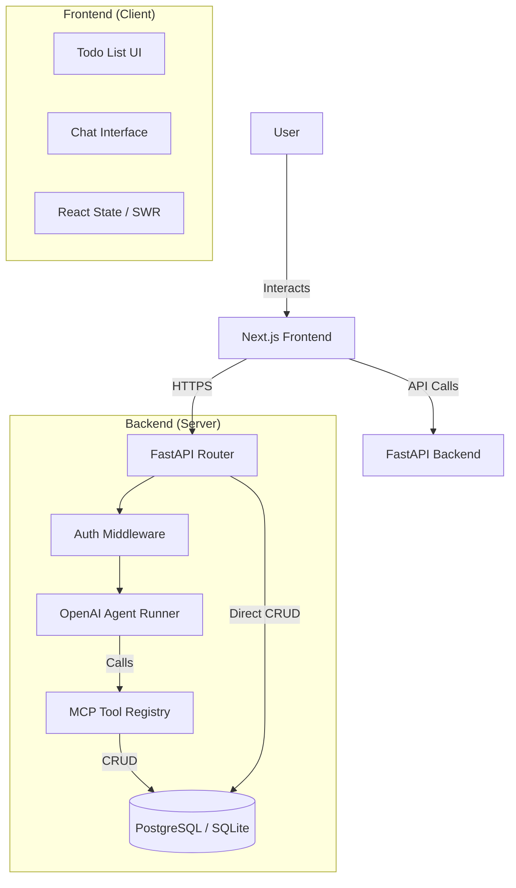

# Architecture Plan

## System Design

## Data Flow (Chat)

1. **User Input:** User types "Remind me to call John" in Chat UI.
2. **Request:** `POST /api/chat` with message and history.
3. **Processing:**
   - Backend retrieves conversation context.
   - Agent analyzes intent using OpenAI API.
   - Agent decides to call `add_task(title="Call John")`.
4. **Tool Execution:**
   - MCP executes `add_task`.
   - DB is updated.
5. **Response:**
   - Agent generates confirmation: "I've added 'Call John' to your list."
   - Response streamed back to Frontend.
6. **UI Update:**
   - Chat shows response.
   - Todo list auto-refreshes (via SWR/polling or optimistic update).

## Component Structure

### Frontend
- `app/page.tsx`: Main layout (Split view: Todo List | Chat).
- `components/todo-list.tsx`: Renders tasks.
- `components/chat-interface.tsx`: Handles chat input and display.
- `components/todo-item.tsx`: Individual task with actions.
- `lib/api.ts`: Fetch wrappers.

### Backend
- `main.py`: App entry point.
- `models.py`: SQLModel definitions.
- `database.py`: DB connection.
- `routes/todos.py`: Standard CRUD endpoints.
- `routes/chat.py`: AI endpoints.
- `agent/tools.py`: MCP tool definitions.
- `agent/graph.py`: Agent orchestration.
